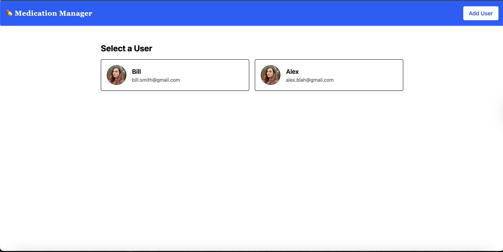
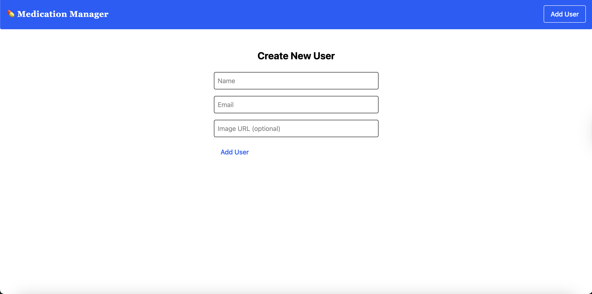
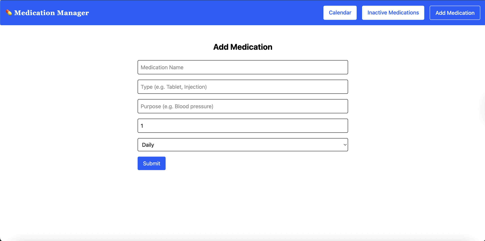
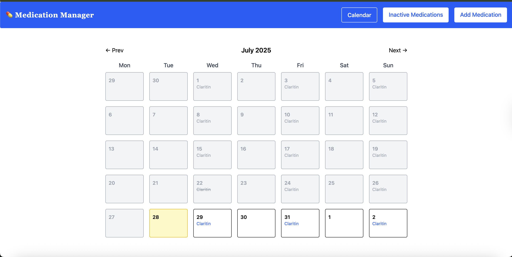
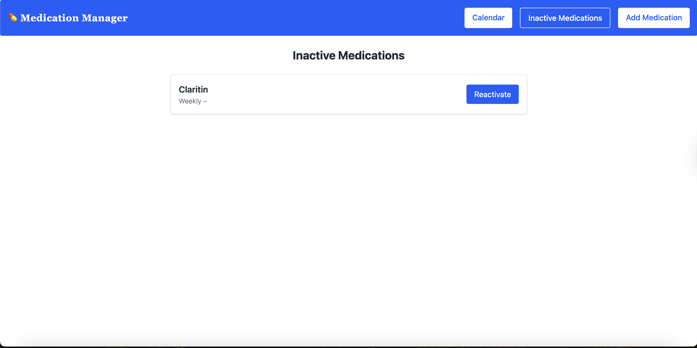

# 💊 Medication Manager

Welcome to the Medication Manager — a modern full-stack application that helps track medications by user, manage dose schedules, log daily intake, and keep inactive meds organized. Whether you're a developer testing out a serverless stack or someone building a medication tracker, this app is a great place to start!

## 🧭 Project Overview

This project is divided into two main parts:

- **`/frontend/`** – A React + TypeScript web application styled with Tailwind CSS, where users can add, view, and manage medications and users.
- **`/backend/`** – A serverless backend written in TypeScript using AWS Lambda, API Gateway, and DynamoDB to store and manage users, medications, and logs.

---

## 🖼️ App Screenshots

### 🧍‍♂️ Select a User Page



---

### ➕ Create New User



---

### 💊 Add Medication Page



---

### 📅 Medication Calendar



---

### 💤 Inactive Medications



---

## 🚀 Getting Started

To run this project locally, you’ll need to start both the frontend and backend projects.

### 1. Clone the repository

```bash
git clone https://github.com/your-username/medication-manager.git
cd medication-manager
```

---

## 📦 Backend

The backend is a serverless app that handles users, medications, and logs.

📁 `/backend`

### Setup & Run

1. Navigate to the backend folder:

   ```bash
   cd backend
   ```

2. Install dependencies:

   ```bash
   npm install
   ```

3. Set up environment variables by creating a `.env` file:

   ```env
   REGION=us-east-1
   USERS_TABLE=MedicationManagerUsers
   MEDICATIONS_TABLE=MedicationManagerMeds
   ```

4. Deploy locally or to AWS using your preferred method (e.g., serverless framework, SST, or AWS SAM).

---

## 🖥️ Frontend

The frontend is built with React, TypeScript, Vite, Tailwind CSS, and uses react-router-dom for routing.

📁 `/frontend`

### Setup & Run

1. Navigate to the frontend folder:

   ```bash
   cd frontend
   ```

2. Install dependencies:

   ```bash
   npm install
   ```

3. Start the development server:

   ```bash
   npm run dev
   ```

4. Create a `.env` file with your API URL:

   ```env
   VITE_API_URL=https://your-api-url.amazonaws.com
   ```

### 🧪 Run Tests

```bash
npm run test
```

---

## 🔐 API Access

To use the deployed backend or make requests, you’ll need an API key or base URL.

> If using API Gateway with an API key, follow these steps:

1. Go to AWS API Gateway.
2. Select your deployed API.
3. Enable API key requirement and create a key.
4. Add the key as a header in requests:

```http
x-api-key: YOUR_API_KEY
```

Or configure it globally in your Axios instance.

---

## 💡 Features

- Multiple users with individual calendars
- Daily medication tracking
- Active/inactive medication toggling
- Built with AWS Lambda + DynamoDB (serverless)
- TypeScript across backend and frontend
- Unit testing with Jest + React Testing Library

---

## 📂 Folder Structure

```bash
medication-manager/
├── backend/           # AWS Lambda functions, TypeScript, DynamoDB
├── frontend/          # React app, Tailwind, routes, UI
├── screenshots/       # App screenshots for documentation
└── types.ts           # Shared types between frontend/backend
```

---

## 🤝 Contributing

PRs, ideas, and feedback are welcome! Fork the repo, make your changes, and submit a pull request.

---

## 📧 Contact

Made with 💙 by [Your Name or GitHub Handle]

---
